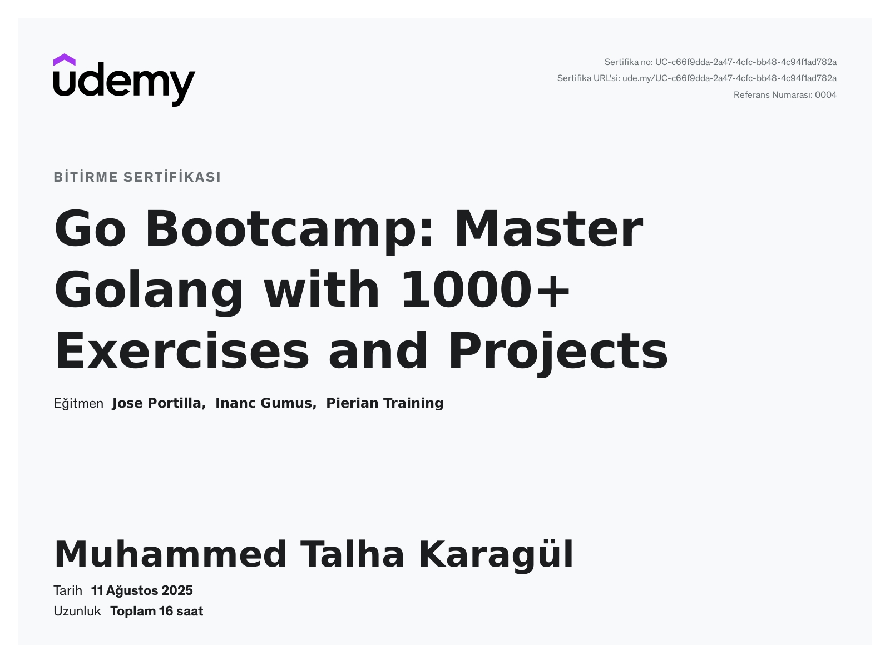

# 📚 Go Exercises

Bu repo, [Learn Go: The Complete Bootcamp Course
(Golang)](https://www.udemy.com/course/learn-go-the-complete-bootcamp-course-golang/)
kursunu takip ederken yaptığım alıştırmalardan oluşmaktadır.

## 🔗 Kurs Sırasında Geliştirdiğim Örnek Projeler

İçerikteki alıştırmalara geçmeden önce, bu kurs kapsamında geliştirdiğim bazı örnek projeler:

-   [ascii-clock-example](https://github.com/karagultm/ascii-clock-example)
    ⏰ Konsolda dijital saat\
-   [ball-game-example](https://github.com/karagultm/ball-game-example)
    🏐 Küçük bir top oyunu\
-   [file-finder-example](https://github.com/karagultm/file-finder-example)
    📂 Dosya arama aracı\
-   [spam-masker-example](https://github.com/karagultm/spam-masker-example)
    🔒 URL maskeleme aracı

## 📂 İçerik

-   `function exercises/` → Fonksiyon pratikleri\
-   `map exercises/` → Map kullanımı\
-   `pointer exercises/` → Pointer pratikleri\
-   `slice exercises/` → Slice işlemleri\
-   `string-rune-bytes exercises/` → String, rune, byte çalışmaları\
-   `struct exercises/` → Struct kullanımı\
-   `text wrapper exercise/` → Text wrapper örneği\
-   `closure.go` → Closure fonksiyon örneği\
-   `loops.go` → Loop kullanımı

## 🏅 Sertifika

Bu projeler, kursu tamamladıktan sonra edindiğim bilgilerin bir
parçasıdır.

